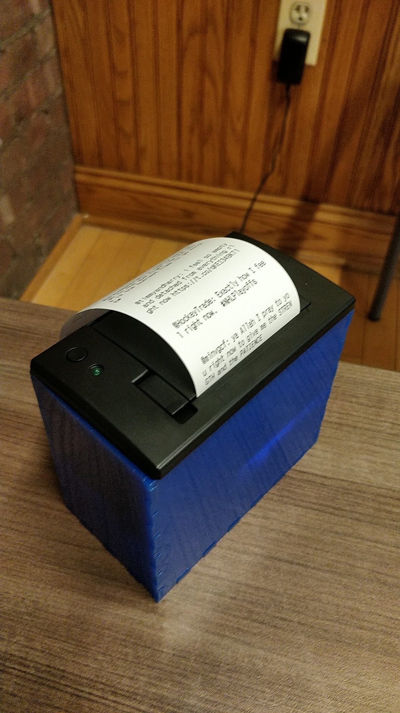
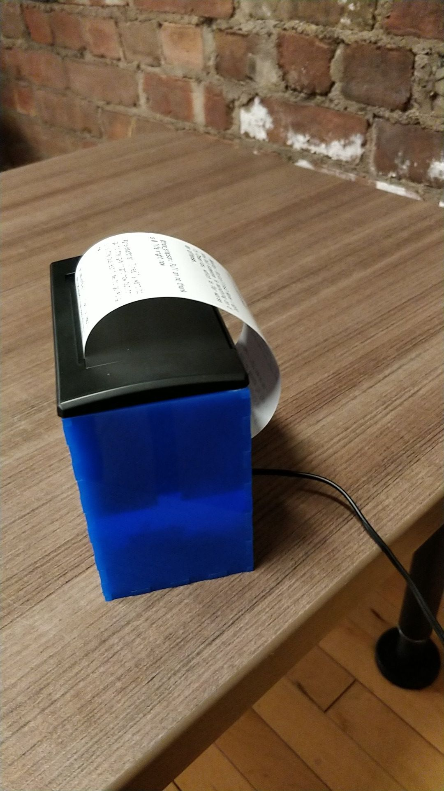

# Time Printer

This project prints tweets with the words "right now" in them, every 5 seconds. As different things happen in the world, the tweets should update to reflect that. This represents the passage of time in a qualitative way. Instead of an Arduino, I am using an ESP8266 board which has WiFi. I am also using a buck converter to step down the 12V power supply to 5V for the printer and ESP8266. The box is made out of acrylic with finger joints.

